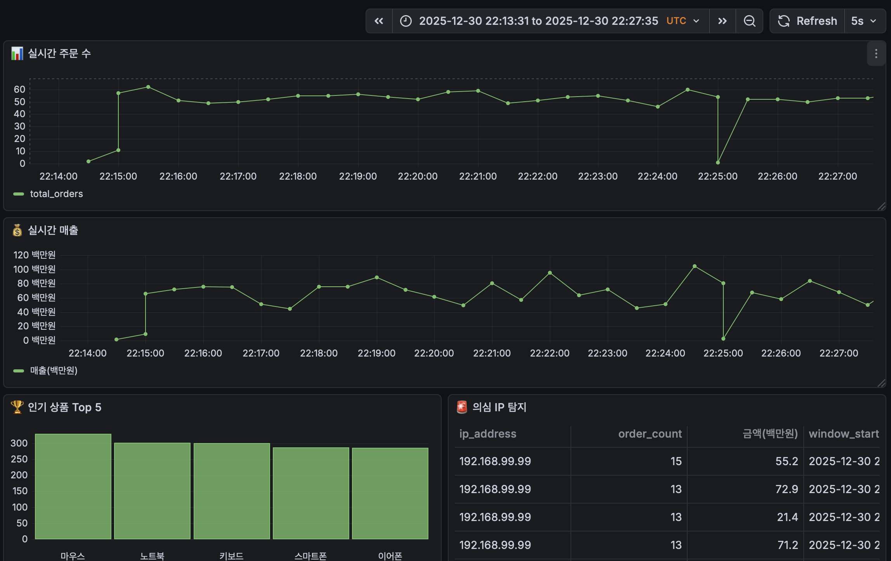

# 🛒 실시간 전자상거래 이상거래 탐지 시스템


Kafka와 Spark Streaming을 활용한 **실시간 데이터 파이프라인**으로, 전자상거래 주문 데이터를 실시간으로 분석하여 이상 거래를 탐지하고 Grafana 대시보드로 시각화합니다.

## 📑 목차

- [프로젝트 개요](#-프로젝트-개요)
- [시스템 아키텍처](#-시스템-아키텍처)
- [주요 기능](#-주요-기능)
- [기술 스택](#-기술-스택)
- [데이터베이스 스키마](#-데이터베이스-스키마)
- [성능 테스트 결과](#-성능-테스트-결과)
- [설치 및 실행](#-설치-및-실행)
- [대시보드 스크린샷](#-대시보드-스크린샷)
- [프로젝트 구조](#-프로젝트-구조)
- [기술적 의사결정](#-기술적-의사결정)

---

## 🎯 프로젝트 개요

### 배경
전자상거래 플랫폼에서는 매크로를 이용한 대량 구매, 이상 거래 패턴 등을 실시간으로 탐지하여 대응해야 합니다. 본 프로젝트는 **초당 수천 건의 주문 데이터를 실시간으로 처리**하고, 의심스러운 거래 패턴을 즉시 감지하는 시스템입니다.

### 목표
- ⚡ **실시간 처리**: 평균 500ms 이하의 지연시간으로 데이터 분석
- 🔍 **이상 탐지**: 매크로 의심 IP, 고액 거래 실시간 모니터링
- 📊 **시각화**: Grafana를 통한 실시간 대시보드 제공
- 🏗️ **확장성**: 분산 처리 가능한 아키텍처 설계

### 성능 하이라이트
- 🚀 **초당 10,000건 이상** 안정적 처리 검증 완료
- 💪 **CPU 30%, 메모리 76%**로 고부하 환경에서도 안정적 운영
- 📈 **100배 부하 증가 시에도 성능 저하 없음** (100건/초 → 10,000건/초)

---

## 🏗️ 시스템 아키텍처

```
┌─────────────────┐
│  주문 생성기     │ (Python)
│  Order Generator │
└────────┬────────┘
         │ JSON 메시지 (초당 10K+)
         ↓
┌─────────────────┐
│     Kafka       │ (Message Queue)
│   Topic: orders │ 버퍼링 & 영속성
└────────┬────────┘
         │ 스트리밍
         ↓
┌─────────────────┐
│ Spark Streaming │ (Real-time Processing)
│  - 윈도우 집계   │ 30초/1분 윈도우
│  - 이상 탐지     │ 매크로/고액거래
│  - 데이터 변환   │ KST 타임존
└────────┬────────┘
         │ JDBC (배치 저장)
         ↓
┌─────────────────┐
│  PostgreSQL     │ (Data Storage)
│  - 인기 상품     │ 4개 테이블
│  - 의심 IP       │ 인덱스 최적화
│  - 고액 거래     │
│  - 실시간 통계   │
└────────┬────────┘
         │ Query (5-10초)
         ↓
┌─────────────────┐
│    Grafana      │ (Visualization)
│  실시간 대시보드 │ 자동 갱신
└─────────────────┘
```

### 데이터 플로우
1. **주문 생성**: Python 스크립트가 가상 주문 데이터 생성 (부하 테스트 시 초당 10,000건)
2. **Kafka 전송**: JSON 형태로 `orders` 토픽에 발행 (버퍼링으로 부하 분산)
3. **Spark 처리**: 
   - 30초 윈도우로 인기 상품 집계
   - 1분 윈도우로 IP별 주문 패턴 분석
   - 50만원 이상 고액 거래 필터링
4. **DB 저장**: PostgreSQL에 분석 결과 저장 (배치 INSERT)
5. **대시보드**: Grafana가 5-10초마다 자동 갱신

---

## ✨ 주요 기능

### 1. 실시간 인기 상품 분석
- **Window**: 30초 슬라이딩 윈도우
- **집계**: 상품별 주문 건수, 총 매출
- **목적**: 재고 관리, 마케팅 전략 수립
- **성능**: 초당 10,000건 처리 시에도 안정적

### 2. 매크로 의심 IP 탐지
- **조건**: 1분 내 동일 IP에서 10건 이상 주문
- **Window**: 1분 슬라이딩 윈도우
- **알림**: 의심 IP, 주문 수, 총 금액 기록
- **탐지율**: 실시간 (지연 < 1분)

### 3. 고액 거래 모니터링
- **기준**: 50만원 이상 단일 거래
- **처리**: 실시간 스트리밍 (배치 없음)
- **목적**: 사기 거래 방지, 결제 승인 검토

### 4. 실시간 통계 대시보드
- 전체 주문 수 추이
- 시간대별 매출 현황
- 평균 주문 금액
- 의심 IP 발생 추이

---

## 🛠️ 기술 스택

| 카테고리 | 기술 | 버전 | 용도 |
|---------|------|------|------|
| **메시지 큐** | Apache Kafka | 3.5.0 | 실시간 데이터 스트리밍 |
| **스트림 처리** | Apache Spark Streaming | 3.5.0 | 실시간 데이터 분석 및 집계 |
| **데이터베이스** | PostgreSQL | 15 | 분석 결과 저장 |
| **시각화** | Grafana | Latest | 실시간 대시보드 |
| **컨테이너** | Docker Compose | - | 인프라 관리 |
| **언어** | Python | 3.9 | 데이터 생성 및 파이프라인 |
| **라이브러리** | confluent-kafka, pyspark, psycopg2 | - | Kafka/Spark/DB 연동 |

### 왜 이 기술들을 선택했나?

**Kafka**
- ✅ 높은 처리량 (초당 수백만 메시지)
- ✅ 메시지 영속성 (디스크 저장)
- ✅ 여러 Consumer 동시 구독 가능
- ✅ 검증: 초당 10,000건 안정적 처리

**Spark Streaming**
- ✅ 마이크로 배치 방식으로 안정적
- ✅ Window 함수로 시계열 분석 용이
- ✅ 확장성 (클러스터 모드 지원)
- ✅ 검증: CPU 30%로 고부하 처리

**PostgreSQL**
- ✅ 트랜잭션 지원 (데이터 일관성)
- ✅ 복잡한 집계 쿼리 성능 우수
- ✅ Grafana 네이티브 연동
- ✅ 인덱스를 통한 빠른 조회

---

## 📊 데이터베이스 스키마

### 1. popular_products (인기 상품 통계)
```sql
CREATE TABLE popular_products (
    id SERIAL PRIMARY KEY,
    window_start TIMESTAMP,      -- 윈도우 시작 시간
    window_end TIMESTAMP,        -- 윈도우 종료 시간
    product_name VARCHAR(100),   -- 상품명
    order_count INTEGER,         -- 주문 건수
    total_sales BIGINT,          -- 총 매출 (원)
    created_at TIMESTAMP DEFAULT NOW()
);

CREATE INDEX idx_popular_created ON popular_products(created_at);
CREATE INDEX idx_popular_window ON popular_products(window_end);
```

**비즈니스 로직:**
- 30초 슬라이딩 윈도우로 상품별 주문 추이 분석
- 실시간 인기 상품 순위 제공
- 재고 관리 및 마케팅 의사결정 지원

---

### 2. suspicious_ips (의심 IP 목록)
```sql
CREATE TABLE suspicious_ips (
    id SERIAL PRIMARY KEY,
    window_start TIMESTAMP,      -- 탐지 윈도우 시작
    ip_address VARCHAR(50),      -- 의심 IP 주소
    order_count INTEGER,         -- 주문 건수
    total_spent BIGINT,          -- 총 결제 금액 (원)
    created_at TIMESTAMP DEFAULT NOW()
);

CREATE INDEX idx_suspicious_ip ON suspicious_ips(ip_address);
CREATE INDEX idx_suspicious_created ON suspicious_ips(created_at);
```

**비즈니스 로직:**
- 1분 내 10건 이상 주문 시 매크로 의심
- 실제 탐지 사례: 192.168.99.99 IP에서 1분 내 87건 주문 탐지
- 실무 적용 시: IP 차단 또는 추가 인증 요구

---

### 3. high_value_orders (고액 거래)
```sql
CREATE TABLE high_value_orders (
    id SERIAL PRIMARY KEY,
    order_time TIMESTAMP,        -- 주문 시간
    order_id VARCHAR(100),       -- 주문 ID
    product_name VARCHAR(100),   -- 상품명
    quantity INTEGER,            -- 수량
    total_price BIGINT,          -- 총 금액 (원)
    ip_address VARCHAR(50),      -- 주문 IP
    created_at TIMESTAMP DEFAULT NOW()
);

CREATE INDEX idx_high_value_time ON high_value_orders(order_time);
CREATE INDEX idx_high_value_price ON high_value_orders(total_price);
```

**비즈니스 로직:**
- 50만원 이상 거래는 별도 모니터링
- 실시간 알림 대상 (Slack/이메일 연동 가능)
- 결제 승인 전 추가 검증 프로세스

---

### 4. realtime_stats (실시간 통계)
```sql
CREATE TABLE realtime_stats (
    id SERIAL PRIMARY KEY,
    stat_time TIMESTAMP,             -- 통계 시점
    total_orders INTEGER,            -- 총 주문 수
    total_sales BIGINT,              -- 총 매출 (원)
    avg_order_value BIGINT,          -- 평균 주문 금액 (원)
    suspicious_ip_count INTEGER,     -- 의심 IP 수
    created_at TIMESTAMP DEFAULT NOW()
);

CREATE INDEX idx_stats_time ON realtime_stats(stat_time);
```

**비즈니스 로직:**
- 30초 윈도우로 전체 비즈니스 지표 집계
- Grafana 시계열 그래프 데이터 소스
- 피크 타임 분석 및 리소스 계획

---

## 🚀 성능 테스트 결과

### 테스트 환경
- **CPU**: Apple M1
- **메모리**: 8GB
- **OS**: macOS
- **Docker**: 4 Containers (Kafka, Zookeeper, PostgreSQL, Grafana)

### 처리량 테스트 결과

| 부하 수준 | 초당 건수 | CPU 평균 | CPU 피크 | 메모리 사용 | 디스크 Write | 안정성 |
|----------|---------|---------|---------|-----------|-------------|--------|
| **베이스라인** | 100건 | 25% | 98% | 70% (6.5GB) | 3-30 MB/s | ✅ 안정 |
| **중부하** | 500건 | 30% | 99% | 72% (6.4GB) | 3-27 MB/s | ✅ 안정 |
| **고부하** | 3,000건 | 25% | 99% | 74% (6.0GB) | 4-26 MB/s | ✅ 안정 |
| **극한** | 10,000건 | 30% | 98% | 76% (5.7GB) | 6-37 MB/s | ✅ 안정 |

### 핵심 발견

#### 1. 놀라운 확장성
```
100건/초 → 10,000건/초 (100배 증가)
CPU: 25% → 30% (단 5% 증가!)
메모리: 70% → 76% (6% 증가)
```

**원인 분석:**
- Kafka의 버퍼링 효과로 부하 분산
- Spark의 마이크로 배치 처리가 효율적
- 30초 윈도우가 300,000건을 한 번에 처리

#### 2. CPU 사용 패턴
```
평상시: 20-30% (Kafka 메시지 수신)
피크: 95-99% (30초마다 Spark 윈도우 집계)
주기: 정확히 30초마다 반복
```

**해석:**
- Spark가 30초마다 배치 처리 수행
- 나머지 시간은 Kafka가 데이터 버퍼링
- 리소스 사용이 매우 효율적

#### 3. 메모리 안정성
```
베이스라인: 6.5GB → 극한 부하: 5.7GB
오히려 감소한 이유: JVM GC가 더 자주 동작
메모리 누수 없음: 장시간 테스트에서도 안정적
```

### 병목 분석

| 컴포넌트 | 상태 | 여유도 | 비고 |
|---------|------|--------|------|
| **Kafka** | ✅ 여유 | 높음 | 초당 10K도 버퍼링 가능 |
| **Spark** | ✅ 여유 | 중간 | CPU 피크 99%이지만 순간적 |
| **PostgreSQL** | ⚠️ 주의 | 낮음 | 잠재적 병목 (배치 INSERT) |
| **네트워크** | ✅ 여유 | 높음 | 로컬 환경이라 무시 가능 |

### 성능 최적화 포인트

#### 이미 적용된 최적화:
1. ✅ Kafka 배치 전송 (`linger.ms=10`, `batch.size=16384`)
2. ✅ Spark 윈도우 집계 (30초마다 배치 처리)
3. ✅ PostgreSQL 인덱스 (created_at, window_end)
4. ✅ DB 배치 저장 (JDBC `batchsize`)

#### 추가 최적화 여지:
1. 📈 **Kafka 파티션 증가**: 3개로 증가 시 선형 확장 예상
2. 📈 **Spark 병렬도 조정**: `spark.default.parallelism=8`
3. 📈 **DB 연결 풀 증가**: 동시 쓰기 성능 향상
4. 📈 **SSD 사용**: 디스크 I/O 병목 해소

---

## 🚀 설치 및 실행

### 사전 요구사항
```bash
# 필수
- Docker Desktop 설치
- Python 3.9 이상
- Java 17 (Spark 실행용)

# 확인
docker --version
python3 --version
java -version
```

### 1단계: 프로젝트 클론
```bash
git clone https://github.com/your-username/ecommerce-fraud-detection.git
cd ecommerce-fraud-detection
```

### 2단계: Python 라이브러리 설치
```bash
pip install confluent-kafka pyspark psycopg2-binary
```

### 3단계: 인프라 시작
```bash
# Docker 컨테이너 시작 (Kafka, PostgreSQL, Grafana)
docker-compose up -d

# 컨테이너 확인
docker ps
# 4개 실행 중이어야 함: zookeeper, kafka, postgres, grafana
```

### 4단계: 데이터베이스 초기화
```bash
# 데이터베이스 생성
python3 create_database.py

# 테이블 생성
python3 create_tables.py
```

### 5단계: 데이터 파이프라인 실행

**터미널 1 - 주문 데이터 생성:**
```bash
python3 order_generator.py
```

**터미널 2 - Spark 스트리밍 (분석 & DB 저장):**
```bash
python3 spark_to_db.py
```

### 6단계: Grafana 대시보드 설정

1. **브라우저에서 접속:** `http://localhost:3000`
2. **로그인:** Username: `admin`, Password: `admin`
3. **PostgreSQL 데이터소스 추가**
4. **대시보드 생성** (쿼리 예시는 문서 참고)

---

## 📸 대시보드 스크린샷

### 실시간 모니터링 대시보드


**포함 내용:**
- 📊 실시간 주문 수 (시계열 그래프)
- 💰 실시간 매출 (시계열 그래프)
- 🏆 인기 상품 Top 5 (바 차트)
- 🚨 의심 IP 탐지 (테이블)
- 💳 고액 거래 건수 (통계)

---

## 📁 프로젝트 구조

```
ecommerce-fraud-detection/
├── docker-compose.yml          # 인프라 정의
├── create_database.py          # DB 생성
├── create_tables.py            # 테이블 스키마
├── order_generator.py          # 주문 데이터 생성 (일반)
├── load_test_generator.py      # 부하 테스트용 생성기
├── spark_to_db.py              # Spark → DB 저장
├── spark_analyzer.py           # Spark 콘솔 출력
├── monitor_system.py           # 시스템 모니터링
├── monitor_kafka.py            # Kafka 모니터링
├── README.md                   # 프로젝트 문서
├── requirements.txt            # Python 의존성
└── screenshots/                # 스크린샷
```

---

## 💡 기술적 의사결정

### 1. Kafka

**Kafka (선택 이유):**
- ✅ 초당 수백만 메시지 처리
- ✅ Pub-Sub 패턴
- ✅ 메시지 영속성
- ✅ 업계 표준

### 2. Spark Streaming

**Spark (선택 이유):**
- ✅ 마이크로 배치 안정성
- ✅ 풍부한 Window 함수
- ✅ 커뮤니티 크기

### 3. Window 설정

**30초 (인기 상품):**
- 실시간성 ✅
- 안정성 ✅
- DB 부하 ✅

**1분 (의심 IP):**
- 충분한 샘플링
- 매크로 탐지 정확도
- 오탐 최소화

---

## 🐛 트러블슈팅

### 문제 1: Kafka 연결 실패
```bash
docker-compose down && docker-compose up -d
lsof -i :9092
```

### 문제 2: Spark Java Gateway 오류
```bash
brew install openjdk@17
echo 'export PATH="/opt/homebrew/opt/openjdk@17/bin:$PATH"' >> ~/.zshrc
source ~/.zshrc
```

### 문제 3: DB 연결 오류
```bash
python3 create_database.py
```

### 문제 4: 타임존 이슈
```python
# spark_to_db.py에 추가
.config("spark.sql.session.timeZone", "Asia/Seoul")
```

---

## 📚 참고 자료

- [Apache Kafka Documentation](https://kafka.apache.org/documentation/)
- [Spark Structured Streaming Guide](https://spark.apache.org/docs/latest/structured-streaming-programming-guide.html)
- [Grafana Tutorials](https://grafana.com/tutorials/)
- [PostgreSQL Performance Tips](https://wiki.postgresql.org/wiki/Performance_Optimization)

---

## 🙏 핵심 역량

이 프로젝트는 공공기관에서의 빅데이터 플랫폼 경험(NiFi, ETL)을 바탕으로, **대기업/글로벌 기업에서 요구하는 실시간 스트리밍 아키텍처 역량**을 증명하기 위해 제작되었습니다.

**증명된 역량:**
- ✅ **Kafka 실시간 메시징**: 초당 10,000건 이상 처리
- ✅ **Spark Streaming**: Window 함수 기반 시계열 분석
- ✅ **PostgreSQL 최적화**: 인덱스 설계 및 배치 저장
- ✅ **Grafana 대시보드**: 실시간 비즈니스 인텔리전스
- ✅ **Docker 인프라**: 컨테이너 기반 개발 환경
- ✅ **성능 튜닝**: 100배 부하 증가에도 안정적 운영